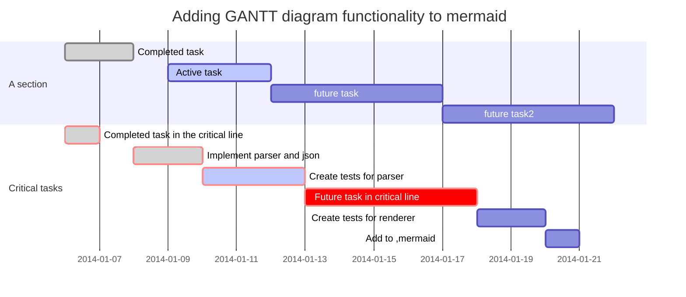

[TOC]

# Linux基础


## 远程

#### **vim设置**

ma6174-github-wget -qO- https://raw.github.com/ma6174/vim/master/setup.sh | sh -x

sudo sh -x setup.sh 	安装配置


#### 远程连接到云主机

ssh 用户名@公网    39.97.167.241	连接远程主机

阿里云用户名为root；点击实例显示详细信息；

1. useradd yzw 名称		新建用户 
2. usermod -G sudo yzw   修改用户组,添加到sudo  赋予root权限,执行超管命令
3. su - yzw 切换到普通用户
4. 切换到root sudo -i       su - root   

#### 配置免密登录

1. sudo vim /etc /hosts		修改hosts文件

   ​	公网 aliyun

   ==将公钥拷贝到云主机==

2. ssh-keygen  生成秘钥对

3. ssh-copy-id yzw@aliyun

4. ssh 检查

#### 其他远程知识

ping 网络ip  		ping:发送包接受包，检测主机是否正常

scp 目录文件 yanzhiwie@公网ip:.  		上传文件到云主机

service sshd restart

service sshd status

vim .bashrc         alias 新的命令='原命令 -选项/参数'     	命令别名

​		source .bashrc 重新载入

tar xvf vim.tar			解压缩包

asciinema play   播放演示

sudo modprobe -r ideapad_laptop

阿里云公网3501152081

 Alt + Y	zoom举放手

Alt + R：开始/停止本地录制

asciinema play   播放演示

Alt + 选中   屏幕取词

ctrl + prtsc  选中区域截图到剪贴板




# vim


## 普通模式

| 命令                           | 说明                 | 备注                  |
| ------------------------------ | -------------------- | --------------------- |
| x  d dd    ndd dw d$ d^ dG dnG | 删除操作             |                       |
| y yy yG    ynG y& y^           | 复制                 |                       |
| p P                            | 粘贴                 |                       |
| gg GG     ngg                  | 移动光标             |                       |
| R cc cG   cnG c& c^            | 替换                 |                       |
| u   ctrl + r    ctrl + v       | undo redo 可视块操作 | 块操作,对某一区域执行 |

## 命令模式


| 命令                  | 说明               | 备注 |
| --------------------- | ------------------ | ---- |
| :w :q :wq :x :wq! :q! | 文件保存退出       |      |
| :args                 | 显示名称，切换文件 |      |
| :e foo.txt            | 打开foo.txt        |      |
| :saveas ~/foo.txt     | 另存为~/foo.txt    |      |
| :split :vsplit        | 切分窗口个         |      |
| :set                  | 设置选项           |      |
|                       |                    |      |


### 配置ctags

```shell
在～目录下

ctags -I __THROW -I __attribute_pure__ -I __nonnull -I __attribute__ --file-scope=yes --langmap=c:+.h --languages=c,c++ --links=yes --c-kinds=+p --c++-kinds=+p --fields=+iaS --extra=+q -f ~/.vim/systags /usr/include/* /usr/include/x86_64-linux-gnu/sys/* /usr/include/x86_64-linux-gnu/bits/* /usr/include/arpa/*


在 .vimrc中添加

set tags+=~/.vim/systags


使用ctags

在工程中使用 ctags -R 建立ctags
在 vim 中 :Tlist  查看函数和结构体
<c-]> 查看函数借口
<c-o>返回
<c-t> 上一个

vim中
Ctrl+t
     标签退栈 
Ctrl+o
     跳转到前一个位置
```


## 其他使用技巧

| 命令        | 说明     | 备注            |
| ----------- | -------- | --------------- |
| Ctrl + z    | 挂起     |                 |
| fg          | 返回前台 | 修改微小错误    |
| /findstring | 查找     |                 |
| jobs        | 所有挂起 | fg 1   打开挂起 |


#### 从系统粘贴板粘到vim

打开一个新的文档，然后按下如下两个按键。


```shell
shift + insert
```

ggVG+y  全选复制
 gg 让光标移到首行，在**vim**才有效，vi中无效 
 V  是进入Visual(可视）模式 
 G 光标移到最后一行 
**选**中内容以后就可以其他的操作了，比如： 
 d 删除**选**中内容 
 y 复制**选**中内容到0号寄存器 
 "+y 复制**选**中内容到＋寄存器，也就是系统的剪贴板，供其他程序用


vimtutor  教程

:set nu   vim打开命令模式，显示行号

:set paste   设置粘贴

:set list   显示隐藏字符


ctrl+s 终止屏幕输出（即停止回显），你敲的依然有效，只是看不见
ctrl+q 恢复屏幕输出，


1.按v进入visual状态，选择多行，用>或<缩进或缩出，it is more effective to all line,invovle in comment line对所有行有效，包括注释行（亲测有效）

2.通常根据语言特征使用自动缩进排版：在命令状态下对当前行用== （连按=两次）, 或对多行用n==（n是自然数）表示自动缩进从当前行起的下面n行。你可以试试把代码缩进任意打乱再用n==排版，相当于一般IDE里的code format。使用gg=G可对整篇代码进行排版。only to normal code line,non annotated line

3.使用Shift +V后通过↑↓选择你要缩进的行，然后按下‘=’即可但是只对非注释行起作用。


\1. 使用vim的比较模式打开两个文件：
vim -d file1 file2
或
vimdiff file1 file2

\2. 如果已经打开了文件file1，再打开另一个文件file2进行比较：
:vert diffsplit file2
如果没有用vert命令，diffsplit则会分上下两个窗口。

\3. 如果已经用split方式打开了两个文件file1，file2，又想比较两文件的不同。
分别在两个窗口里面输入命令：
:diffthis

#### 4.1 行尾批量加分号

假设想在某个文件的一系列行尾添加一个分号 **;**，使用vim重复操作命令 `.` 当然可以完成这一任务。但是如果想对100行内容执行末尾加分号的操作，如果使用 `.` 命令，则需要按100次 `j.`，这显然不是一个好的方法。

为了完成上述任务，vim教程网介绍一种使用 `normal` 命令执行 `.` 命令的新方法。

- 首先使用命令 `A;` 在光标所在当前行末尾增加 **;**
- 然后按 `j` 跳到下一行末尾后按 `V` 进入vim块选择可视化模式，然后按 `G` 跳转到文件尾行，从而完成目标行的选择
- 最后，在vim命令行模式下执行命令 `:'<,'>normal .`

```shell
:'<,'>normal .` 命令可以解读为 **对高亮选区中的每一行** 执行普通模式下的 `.
```


# Linux发展史

### Unix出现

Multics --> Unics --> Unix

### Linux代表


centos为免费版用于测试，RHEL用于商业版。	中国浪潮公司

OpenSUSE为免费版用于测试，SLES用于商业	 中国华为公司


### 英语

| 英语       | 汉译       | 备注 |
| ---------- | ---------- | ---- |
| interfaces | 接口，界面 |      |
| mod        | 属性,权限  |      |
|            |            |      |

python -V 查看默认版本

which python3 检查位置

exit       ctrl + D    ctrl + c   退出命令

升级 Python3

ls -al /usr/bin/python  查看指定目录下文件

rm -f /usr/bin/python     -r 向下递归，所有下级目录，一并删除
  -f 直接强行删除 

ln -s /usr/bin/python3 /usr/bin/python  指定链接

tldr 命令手册


# Linux 认识


## shell

>  ```shell```是人机交互的接口，英文为==壳==；指 "***提供使用者使用界面***"；是一种命令解释器。

> windows 的cmd是一种shell。 ```shell``并不只是指命令语言
>
> GUI也是种``` shell ```

```flow
open=>start: shell接收用户提交的命令
processes=>operation: 在系统中调入内存执行
results=>condition: 是否内置？
userr=>operation: 内核中的系统调用
end=>end: End
open->results
results(yes)->userr
results(no)->processes	

```

echo $PATH``  找可执行程序的路径     在系統中调用

对于非内置命令,将在PATH下,寻找同名可执行程序

例如 cd  內置    内核中的系统调用

## 命令

> 命令是人和计算机交互的基本单位，人使用命令将要做的事传达给计算机做出解析，并作出回应。

```shell
cp  -ar fileA fileB
```

> 一般 ```-```后面加选项缩写，`--`后面加选项全称

## 程序与进程

>  程序是一个可执行的二进制文件,命令是程序.

> 进程是程序在内存的镜像
>
> 进程也可理解为程序实例化的产物

``` shell
which cp # 找到cp命令的位置
ll /bin/cp
file /bin/cp   # 查看cp命令的具体信息
```


## 路径

### 绝对路径

绝对路径起始点为根目录 `/`如`/usr/bin/cp`就是一个绝对路径

### 相对路径

相对路径的起始点为当前路径`.`，加入用户当前

- 相对路径 从当前开始 .  或者 ..
- `.` 当前目录, `..` 上一级目录(当前目录父目录)
- pwd:打印当前工作目录  print working directory
- cd: 切换工作目录  change directoty
  1. ​    cd - 返回上一次目录
  2. ​    cd ../../
  3. ​    cd ./
  4. cd  默认切换到用户目录
  5. cd ~切换到家目录
  6. cd ~username 切换到其他user家目录

### 远程路径

远程路径的一般表示：`协议://用户名:密码@位置/路径:端口`

例如:

`http://haizeix.com`

`ftp;//user:passwd@ftp.haizeix.com:21`

## 软件

在Linux中,软件没有像注册表这样的概念.

> 注册表:Microsoft Windows中的一个重要数据库,用于存储系统和应用程序的设置信息。

> 安装软件理论上只需要拷贝相关文件并执行其主程序就可以

通常，一个软件包含的内容会分别拷贝到同级别的`bin lib share`和`/etc`目录下

> **bin** 存放程序的可执行文件。在系统环境变量中将该路径添加进去可直接执行程序
>
> **lib** 库文件集中存放，方便共享
>
> **share** 存放程序需要的其它资源
>
> **/etc** 配置文件的存放路径

## 配置方式

> `/etc/network/interface`文件为Ubuntu的网络配置文件通过修改该文件并重启网络就可以实现网络的配置工作

```shell
ifconfig enth0 172.17.211.175
```

更新`eth0`d的IP地址

## 隐藏文件

Linux中的隐藏文件都以`.`开头；

`ls -a ` 可显示隐藏文件

## 文件类型

`ll` 等效于 `ls -al` 显示当前文件夹所有文件的详细信息

```shell
drwx------  2 root root     16384 Mar 29 12:39 lost+found/drwxr-xr-x  4 root root      4096 Mar 29 12:39 media/drwxr-xr-x  2 root root      4096 Aug  6  2019 mnt/drwxr-xr-x  2 root root      4096 Aug  6  2019 opt/dr-xr-xr-x 83 root root         0 Apr 18 16:17 proc/drwx------  6 root root      4096 Apr 19 16:22 root/drwxr-xr-x 21 root root       660 Apr 21 15:32 run/drwxr-xr-x  2 root root     12288 Mar 29 12:47 sbin/drwxr-xr-x  2 root root      4096 Aug  6  2019 srv/-rw-------  1 root root 993249280 Mar 29 12:39 swapfiledr-xr-xr-x 13 root root         0 Apr 19 00:17 sys/
```

输出内容依次为：权限、文件数、所属用户、所属群组、文件大小、常见日期、文件名

第一列权限

> | 文件类型 | 所属用户权限 | 所属群组 | 其他用户 |
> | :------: | :----------: | :------: | :------: |
> |    d     |     rwx      |   r-x    |   r-x    |

- `-` regular file 普通文件
- `d` **d**iretcoty 目录
- `l` **l**ink 链接
- `b` **b**lock 块设备 存取数据以供以系统存取的接口设备即硬盘
- `c` **c**haracter 字符设备 串口设备键盘鼠标...
- `s` **s**ocket 套接字
- `p` **p**ipe 管道

普通文件分三种

- 纯文本文件   使用ASCII编码，可直接读取。几乎所有配置文件为该类型
- 二进制文件    系统中可执行文件(不包括脚步),计算机只能认识并执行二进制文件。二进制文件不可用`cat` 等命令直接读出
- 数据格式文件    特定格式的文件,强读出现乱码。通常不可用`cat`读出

## 文件权限

> 文件权限包含三组(`u`用户,`g`群组,`o`其他用户),每组包含三种权限(rwx)

|   r    |   w    |    x    |
| :----: | :----: | :-----: |
| 2^2^=4 | 2^1^=2 | 2^0^ =1 |

> 权限为`rwxr-x--x`的文件，其权限可使用`751`表示
>
> 拥有x 权限,可查看文件

### 与文件权限有关的命令

```shell
chmod #更改文件权限chown #更改文件所属用户chgrp #更改文件所属组
```

- `chmod`的用法

```shell
chmod a+x file #给file文件的ugo都赋予执行权限chmod o-x file #给file文件o减去执行权限chmod 755 file #设置file文件的权限为rwxr-xr-xchmod u=rwx,go=rx file #设置file文件的权限为rwxr-xr-x
```

- `chown`的用法

```shell
chown yzw:wei file #修改file的所属用户是yzw，所属组为weichown -R yzw:wie directory #修改目录directory及目录下的所有文件ugchown yzw file #修改file的所属用户为yzw
```

- `chgrp`的用法

```shell
chgrp root fiel #修改file所属组为root
```

## 用户

超级管理员 `root`

管理员 增加一个附属组，可临时切换道root

普通用户

> `su - root` 这里的`-` 代表切换到用户，并初始化。相当于重新登陆


## Linux系统目录


- **`/bin `**(/usr/bin、/usr/local/bin)
  是Binary的缩写, 这个目录存放着最经常使用的命令

- sbin`(/usr/sbin、/usr/local/sbin)
  s就是Super User的意思，这里存放的是系统管理员使用的系统管理程序。

- **`/home`**
  存放普通用户的主目录，在Linux中每个用户都有一个自己的目录，一般该目录名是以用户的账号命名的。

- **`/root`**
  该目录为系统管理员，也称作超级权限者的用户主目录。

- **`/lib`**
  系统程序库文件

- /lost+found
  这个目录一般情况下是空的，当系统非法关机后，这里就存放了一些文件。

- **`/etc` **
  所有的系统管理所需要的配置文件和子目录my.conf

- **`/usr`** 
  这是一个非常重要的目录，用户的很多应用程序和文件都放在这个目录下，类似与windows下的program files目录。

- **`/boot`** 
  启动文件，所有与系统启动有关的文件都保存在这里

- /proc
  内核与进程镜像

- /srv
  这是linux2.6内核的一个很大的变化。该目录下安装了2.6内核中新出现的一个文件系统sysfs

- /tmp
  这个目录是用来存放一些临时文件的。重启会清空

- /dev
  设备文件。类似于windows的设备管理器，把所有的硬件用文件的形式存储。

- **`/media`**
  linux系统会自动识别一些设备，例如U盘、光驱等等，当识别后，linux 会把识别的设备挂载到这个目录下。

- **`/mnt`** 
  系统提供该目录是为了让用户临时挂载别的文件系统的，我们可以将外部的存储挂载在/mnt/上，然后进入该目录就可以查看里的内
  容了。

- /opt
  这是给主机额外安装软件所摆放的目录。如安装ORACLE数据库就可放到该目录下。默认为空。

- /usr/local [重点]
  这是另一个给主机额外安装软件所安装的目录。一般是通过编译源码方式安装的程序。

- /usr/share

  应用程序资源文件

- **`/var`** 
  这个目录中存放着在不断扩充着的东西，习惯将经常被修改的目录放在这个目录下。包括各种日志文件。动态数据

> 家目录是`HOME`,是一个环境变量，`/home/用户名`。`/home`并不是


## 开机启动流程


BIOS 基本输出系统