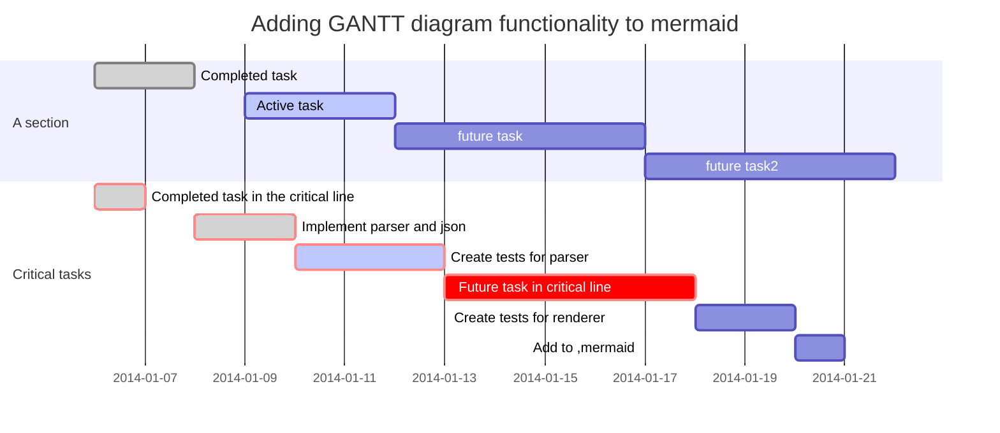

[TOC]

# Linux基础


## 远程

#### 远程连接到云主机

ssh 用户名@公网    39.97.167.241	连接远程主机

阿里云用户名为root；点击实例显示详细信息；

1. useradd yzw 名称		新建用户 
2. usermod -G sudo yzw   修改用户组,添加到sudo  赋予root权限,执行超管命令
3. su - yzw 切换到普通用户
4. 切换到root sudo -i       su - root   

#### 配置免密登录

1. sudo vim /etc /hosts		修改hosts文件

   ​	公网 aliyun

   ==将公钥拷贝到云主机==

2. ssh-keygen  生成秘钥对

3. ssh-copy-id yzw@aliyun

4. ssh 检查

#### 其他远程知识

ping 网络ip  		ping:发送包接受包，检测主机是否正常

scp 目录文件 yanzhiwie@公网ip:.  		上传文件到云主机

service sshd restart

service sshd status

vim .bashrc         alias 新的命令='原命令 -选项/参数'     	命令别名

​		source .bashrc 重新载入

tar xvf vim.tar			解压缩包

asciinema play   播放演示

sudo modprobe -r ideapad_laptop

阿里云公网3501152081

 Alt + Y	zoom举放手

Alt + R：开始/停止本地录制

asciinema play   播放演示

Alt + 选中   屏幕取词

ctrl + prtsc  选中区域截图到剪贴板




## vim

### **vim设置**

ma6174-github-wget -qO- https://raw.github.com/ma6174/vim/master/setup.sh | sh -x

sudo sh -x setup.sh 	安装配置

### 配置文件

Vim 的全局配置文件为 `/etc/vim/vimrc` ，用户配置文件为 `~/.vimrc` 


### vimtutor教学

```shell
$vimtutor [语言]
$vimtutor zh en
```


### VIM四种模式


#### 插入模式

| i    | 在光标前插入 |
| ---- | ------------ |
| I    | 在行首插入   |
| a    | 在光标后插入 |
| A    | 在行末插入   |
| o    | 在当前行之下新建行 |
| O    | 在当前行之上新建行 |
| r    | 替换当前字符       |
| R    | 从当前字符开始替换 |

#### 普通模式

| 命令                           | 说明                 | 备注                  |
| ------------------------------ | -------------------- | --------------------- |
| x  d dd    ndd dw d$ d^ dG dnG | 删除操作             |                       |
| y yy yG    ynG y& y^           | 复制                 |                       |
| Ctrl+y  |	逐字克隆上一行内容 |
| Ctrl+e  |	逐字克隆下一行内容 |
| p P                            | 粘贴                 |                       |
| gg GG     ngg                  | 移动光标             |                       |
| R cc cG   cnG c& c^            | 替换                 |                       |
| u   ctrl + r    ctrl + v       | undo redo 可视块操作 | 块操作,对某一区域执行 |

#### 可视模式

| v      | 可视模式   |
| ------ | ---------- |
| V      | 可视行模式 |
| Ctrl+v | 可视块模式 |


#### 命令模式


| 命令                  | 说明                         | 备注                         |
| --------------------- | ---------------------------- | ---------------------------- |
| :w :q :wq :x :wq! :q! | 文件保存退出                 |                              |
| :args                 | 显示名称，切换文件           |                              |
| :e foo.txt            | 打开foo.txt                  |                              |
| :saveas ~/foo.txt     | 另存为~/foo.txt              |                              |
| :split                |   `:sp` or `Ctrl-w s` 上下分屏                            |  |
| :vsplit               | `:vs` or `Ctrl-w v` 左右分屏 |                              |
| :set                  | 设置选项                     |                              |
| :set nu | vim打开命令模式，显示行号 |                              |
| :set paste | 设置粘贴 | |
| :set list | 显示隐藏字符 | |

  


### 移动

|       |       | k(上) |       |
| ----- | ----- | ----- | ----- |
| h(左) |       |       | l(右) |
|       | j(下) |       |       |

|                        | 向前 | 向后 |
| ---------------------- | ---- | ---- |
| 单词                   | w    | b    |
| 单词，包括特殊符号     | W    | B    |
| 单词词尾               | e    |      |
| 单词词尾，包括特殊符号 | E    |      |
|                        |      |      |
| 行                     | 0    | $    |
| 行首文字（不包括空格） | ^    |      |
|                        |      |      |
| 页                     | H    | L    |
| 页面中部               | M    |      |
| 按行号转到相应行 | 行号 G |`:num`|
|  |  ||

**`gg`** 定位到文件首行， **`V`** 进入可视行模式， **`G`** 定位到文件末行，实现类似“全选”的功能。依次按下 **`g`** **`g`** **`V`**(Shift+v) **`G`**(Shift+g)

### 分屏

#### 分屏方式

- `:split` 缩写 `:sp` or `Ctrl-w s` 上下分屏
- `:vsplit` 缩写 `:vs` or `Ctrl-w v` 左右分屏
- `:diffsplit` 缩写 `:diffs` diff 模式打开一个分屏，后面可以加上 {filename}

- `:new` 当前窗口水平分为两栏
- `:vnew` 当前窗口垂直分为两栏

#### 窗口跳转

- `Ctrl-w w` 激活下一个窗口
- `Ctrl-w j` 激活下方窗口
- `Ctrl-w k` 激活上方窗口
- `Ctrl-w h` 激活左侧窗口
- `Ctrl-w l` 激活右侧窗口

#### 移动分屏

- `Ctrl-w L` 移动到最右侧
- `Ctrl-w H` 移动到最左侧
- `Ctrl-w K` 移动到顶部
- `Ctrl-w J` 移动到底部

#### 命令在所有栏中生效

```shell
:命令all
:qall 退出所有栏窗口
```

## 标签页

```shell
:tabnew    新建一个标签
:tabnext   转到下一个标签
:tabprevious  转到上一个标签
```


### 配置ctags

```shell
在～目录下

ctags -I __THROW -I __attribute_pure__ -I __nonnull -I __attribute__ --file-scope=yes --langmap=c:+.h --languages=c,c++ --links=yes --c-kinds=+p --c++-kinds=+p --fields=+iaS --extra=+q -f ~/.vim/systags /usr/include/* /usr/include/x86_64-linux-gnu/sys/* /usr/include/x86_64-linux-gnu/bits/* /usr/include/arpa/*


在 .vimrc中添加

set tags+=~/.vim/systags

使用ctags

在工程中使用 ctags -R 建立ctags
在 vim 中 :Tlist  查看函数和结构体
<c-]> 查看函数借口
<c-o>返回
<c-t> 上一个

vim中
Ctrl+t
     标签退栈 
Ctrl+o
     跳转到前一个位置
```


## 其他使用技巧

| 命令        | 说明     | 备注            |
| ----------- | -------- | --------------- |
| Ctrl + z    | 挂起     |                 |
| fg          | 返回前台 | 修改微小错误    |
| /findstring | 查找     |                 |
| jobs        | 所有挂起 | fg 1   打开挂起 |


#### 从系统粘贴板粘到vim

打开一个新的文档，然后按下如下两个按键。

```shell
shift + insert
```

 ggVG+y  全选复制
 gg 让光标移到首行，在**vim**才有效，vi中无效 
 V  是进入Visual(可视）模式 
 G 光标移到最后一行 
**选**中内容以后就可以其他的操作了，比如： 
 d 删除**选**中内容 
 y 复制**选**中内容到0号寄存器 
 "+y 复制**选**中内容到＋寄存器，也就是系统的剪贴板，供其他程序用


#### 使用 Vim 比较文件区别

```shell
$vimdiff [文件1] [文件2] [其它文件]……  
```


ctrl+s 终止屏幕输出（即停止回显）
ctrl+q 恢复屏幕输出，

### 搜索和替换

按下 **`/`** 键，编辑器底部会出现 **`/`** 符号，接着输入字符串，便可以进行搜索

| /    | 向下搜索   | ?    | 向上搜索   |
| ---- | ---------- | ---- | ---------- |
| n    | 搜索下一个 | N    | 搜索上一个 |

| :s/源字符串/目标字符串              | 将源字符串替换为目标字符串       |
| ----------------------------------- | -------------------------------- |
| :s/源字符串/目标字符串/g            | 替换当前行中所有符合条件的字符串 |
| :行号1,行号2s/源字符串/目标字符串/g | 在指定行中进行替换               |
| :%s/源字符串/目标字符串/g           | 全文替换                         |
| :%s/^/要添加的内容                  | 在每行行首添加相同的内容：       |
| :%s/$/要添加的内容                  | 在每行行尾添加相同的内容：       |

```shell
删除空行
:g/^$/d

删除空行以及只有空格的行
:g/^\s*$/d

删除从第二行到包含 bbs 的区间行
:2,/bbs/d

删除匹配 bbs 且以它开头的行

:g/^bbs/d

删除匹配 bbs 且以它结尾的行

:g/bbs$/d

删除之后所有字符
%s/\#.*//g
```


### 缩进

- `>>` 向右缩进当前行
- `<<` 向左缩进当前行

### 自动排版

- `==` 自动排版当前行
- `gg=G` 当前文档全文自动排版
- `<N>==` 对从当前行开始的 N 行进行自动排版
- `=<N>j` 对当前行以及向下 N 行进行自动排版
- `=<N>k` 对当前行以及向上 N 行进行自动排版


# Linux发展史

## Unix出现

Multics --> Unics --> Unix


- 最上面所标识的操作系统版本，是加州大学伯克利分校（BSD）研究出的分支，学院派
-  中间Research 橘黄色部分：AT&T 贝尔实验室不断开发的 UNIX 研究版本
- 最下面的那一个部分，是从 AT&T 分支的商业派，致力于从 UNIX 系统中谋取商业利润。


#### GNU

 GNU（GNU’s NOT UNIX），它的创始人理查·斯托曼（Richard Stallman）。斯托曼的想法是设计一个完全自由的软件系统，用户可以自由使用，自由修改这些软件系统。

GNU 在自由软件基金会统一组织下，相继续推出了编译器 GCC、调试器 GDB、Bash Shell 等运行于用户空间的程序。独缺操作系统核心。

GNU 和 GNU/Linux 互相造就了对方

## Linux代表


centos为免费版用于测试，RHEL用于商业版。	中国浪潮公司

OpenSUSE为免费版用于测试，SLES用于商业	 中国华为公司


### 英语

| 英语       | 汉译       | 备注 |
| ---------- | ---------- | ---- |
| interfaces | 接口，界面 |      |
| mod        | 属性,权限  |      |
|            |            |      |

python -V 查看默认版本

which python3 检查位置

exit       ctrl + D    ctrl + c   退出命令

升级 Python3

ls -al /usr/bin/python  查看指定目录下文件

rm -f /usr/bin/python     -r 向下递归，所有下级目录，一并删除
  -f 直接强行删除 

ln -s /usr/bin/python3 /usr/bin/python  指定链接

tldr 命令手册


# Linux 认识

# 名词

**`GUI`**，Graphical User Interface，图形用户界面。用户界面的所有元素图形化，主要使用鼠标作为输入工具，点击图标执行程序，使用按钮、菜单、对话框等进行交互，追求易用，看起来比较美

**`CLI`**，Command Line Interface，命令行界面。用户界面字符化，使用键盘作为输入工具，输入命令、选项、参数执行程序，追求高效，看起来比较酷


## shell

>  ```shell```是人机交互的接口，英文为==壳==；指 "***提供使用者使用界面***"；是一种命令解释器。

> windows 的cmd是一种shell。 ```shell``并不只是指命令语言
>
> GUI也是种``` shell ```

```flow
open=>start: shell接收用户提交的命令
processes=>operation: 在系统中调入内存执行
results=>condition: 是否内置？
userr=>operation: 内核中的系统调用
end=>end: End
open->results
results(yes)->userr
results(no)->processes	

```

`echo $PATH`  找可执行程序的路径     在系統中调用

对于非内置命令,将在PATH下,寻找同名可执行程序

例如 cd  內置    内核中的系统调用

### PATH

可以在环境变量 PATH 中声明可执行文件的路径，路径之间用 : 分隔。

```html
/usr/local/bin:/usr/bin:/usr/local/sbin:/usr/sbin:/home/dmtsai/.local/bin:/home/dmtsai/bin
```

## 命令

> 命令是人和计算机交互的基本单位，人使用命令将要做的事传达给计算机做出解析，并作出回应。

```shell
cp  -ar fileA fileB
```

> 一般 ```-```后面加选项缩写，`--`后面加选项全称

## 程序与进程

>  程序是一个可执行的二进制文件,命令是程序.

> 进程是程序在内存的镜像
>
> 进程也可理解为程序实例化的产物

``` shell
which cp # 找到cp命令的位置
ll /bin/cp
file /bin/cp   # 查看cp命令的具体信息
```


## 路径

### 绝对路径

绝对路径起始点为根目录 `/`如`/usr/bin/cp`就是一个绝对路径

### 相对路径

相对路径的起始点为当前路径`.`，加入用户当前

- 相对路径 从当前开始 .  或者 ..
- `.` 当前目录, `..` 上一级目录(当前目录父目录)
- pwd:打印当前工作目录  print working directory
- cd: 切换工作目录  change directoty
  1. ​    cd - 返回上一次目录
  2. ​    cd ../../
  3. ​    cd ./
  4. cd  默认切换到用户目录
  5. cd ~切换到家目录
  6. cd ~username 切换到其他user家目录

### 远程路径

远程路径的一般表示：`协议://用户名:密码@位置/路径:端口`

例如:

`http://haizeix.com`

`ftp;//user:passwd@ftp.haizeix.com:21`

## 软件

在Linux中,软件没有像注册表这样的概念.

> 注册表:Microsoft Windows中的一个重要数据库,用于存储系统和应用程序的设置信息。

> 安装软件理论上只需要拷贝相关文件并执行其主程序就可以

通常，一个软件包含的内容会分别拷贝到同级别的`bin lib share`和`/etc`目录下

> **bin** 存放程序的可执行文件。在系统环境变量中将该路径添加进去可直接执行程序
>
> **lib** 库文件集中存放，方便共享
>
> **share** 存放程序需要的其它资源
>
> **/etc** 配置文件的存放路径

## 配置方式

> `/etc/network/interface`文件为Ubuntu的网络配置文件通过修改该文件并重启网络就可以实现网络的配置工作

```shell
ifconfig enth0 172.17.211.175
```

更新`eth0`d的IP地址

## 隐藏文件

Linux中的隐藏文件都以`.`开头；

`ls -a ` 可显示隐藏文件

## 文件类型

`ll` 等效于 `ls -al` 显示当前文件夹所有文件的详细信息

```shell
drwx------  2 root root     16384 Mar 29 12:39 lost+found/drwxr-xr-x  4 root root      4096 Mar 29 12:39 media/drwxr-xr-x  2 root root      4096 Aug  6  2019 mnt/drwxr-xr-x  2 root root      4096 Aug  6  2019 opt/dr-xr-xr-x 83 root root         0 Apr 18 16:17 proc/drwx------  6 root root      4096 Apr 19 16:22 root/drwxr-xr-x 21 root root       660 Apr 21 15:32 run/drwxr-xr-x  2 root root     12288 Mar 29 12:47 sbin/drwxr-xr-x  2 root root      4096 Aug  6  2019 srv/-rw-------  1 root root 993249280 Mar 29 12:39 swapfiledr-xr-xr-x 13 root root         0 Apr 19 00:17 sys/
```

输出内容依次为：权限、文件数、所属用户、所属群组、文件大小、常见日期、文件名

第一列权限

> | 文件类型 | 所属用户权限 | 所属群组 | 其他用户 |
> | :------: | :----------: | :------: | :------: |
> |    d     |     rwx      |   r-x    |   r-x    |

- `-` regular file 普通文件
- `d` **d**iretcoty 目录
- `l` **l**ink 链接
- `b` **b**lock 块设备 存取数据以供以系统存取的接口设备即硬盘
- `c` **c**haracter 字符设备 串口设备键盘鼠标...
- `s` **s**ocket 套接字
- `p` **p**ipe 管道

普通文件分三种

- 纯文本文件   使用ASCII编码，可直接读取。几乎所有配置文件为该类型
- 二进制文件    系统中可执行文件(不包括脚步),计算机只能认识并执行二进制文件。二进制文件不可用`cat` 等命令直接读出
- 数据格式文件    特定格式的文件,强读出现乱码。通常不可用`cat`读出

## 文件权限

> 文件权限包含三组(`u`用户,`g`群组,`o`其他用户),每组包含三种权限(rwx)

| r(read) | w(write) | x(execute) |
| :-----: | :------: | :--------: |
| 2^2^=4  |  2^1^=2  |  2^0^ =1   |

> 权限为`rwxr-x--x`的文件，其权限可使用`751`表示
>
> 拥有x 权限,可查看文件


### 文件时间

文件时间有以下三种：

- modification time (mtime)：文件的内容更新就会更新；
- status time (ctime)：文件的状态（权限、属性）更新就会更新；
- access time (atime)：读取文件时就会更新。

### 与文件权限有关的命令

```shell
chmod #更改文件权限chown #更改文件所属用户chgrp #更改文件所属组
```

- `chmod`的用法

```shell
chmod a+x file #给file文件的ugo都赋予执行权限chmod o-x file #给file文件o减去执行权限chmod 755 file #设置file文件的权限为rwxr-xr-xchmod u=rwx,go=rx file #设置file文件的权限为rwxr-xr-x
```

- `chown`的用法

```shell
chown yzw:wei file #修改file的所属用户是yzw，所属组为weichown -R yzw:wie directory #修改目录directory及目录下的所有文件ugchown yzw file #修改file的所属用户为yzw
```

- `chgrp`的用法

```shell
chgrp root fiel #修改file所属组为root
```

## 用户

超级管理员 `root`

管理员 增加一个附属组，可临时切换道root

普通用户

> `su - root` 这里的`-` 代表切换到用户，并初始化。相当于重新登陆


## Linux系统目录


- **`/bin `**(/usr/bin、/usr/local/bin)
  是Binary的缩写, 这个目录存放着最经常使用的命令

- sbin`(/usr/sbin、/usr/local/sbin)
  s就是Super User的意思，这里存放的是系统管理员使用的系统管理程序。

- **`/home`**
  存放普通用户的主目录，在Linux中每个用户都有一个自己的目录，一般该目录名是以用户的账号命名的。

- **`/root`**
  该目录为系统管理员，也称作超级权限者的用户主目录。

- **`/lib`**
  系统程序库文件

- /lost+found
  这个目录一般情况下是空的，当系统非法关机后，这里就存放了一些文件。

- **`/etc` **
  所有的系统管理所需要的配置文件和子目录my.conf

- **`/usr`** 
  这是一个非常重要的目录，用户的很多应用程序和文件都放在这个目录下，类似与windows下的program files目录。

- **`/boot`** 
  启动文件，所有与系统启动有关的文件都保存在这里

- /proc
  内核与进程镜像

- /srv
  这是linux2.6内核的一个很大的变化。该目录下安装了2.6内核中新出现的一个文件系统sysfs

- /tmp
  这个目录是用来存放一些临时文件的。重启会清空

- /dev
  设备文件。类似于windows的设备管理器，把所有的硬件用文件的形式存储。

- **`/media`**
  linux系统会自动识别一些设备，例如U盘、光驱等等，当识别后，linux 会把识别的设备挂载到这个目录下。

- **`/mnt`** 
  系统提供该目录是为了让用户临时挂载别的文件系统的，我们可以将外部的存储挂载在/mnt/上，然后进入该目录就可以查看里的内
  容了。

- /opt
  这是给主机额外安装软件所摆放的目录。如安装ORACLE数据库就可放到该目录下。默认为空。

- /usr/local [重点]
  这是另一个给主机额外安装软件所安装的目录。一般是通过编译源码方式安装的程序。

- /usr/share

  应用程序资源文件

- **`/var`** 
  这个目录中存放着在不断扩充着的东西，习惯将经常被修改的目录放在这个目录下。包括各种日志文件。动态数据

> 家目录是`HOME`,是一个环境变量，`/home/用户名`。`/home`并不是


### 全局配置文件


**表 15.1.** 

| 系统初始化              | /etc/inittab           | 运行级别、控制台数量 |
| ----------------------- | ---------------------- | -------------------- |
| /etc/timezone           | 时区                   |                      |
| /etc/inetd.conf         | 超级进程               |                      |
| 文件系统                | /etc/fstab             | 开机时挂载的文件系统 |
| /etc/mtab               | 当前挂载的文件系统     |                      |
| 用户系统                | /etc/passwd            | 用户信息             |
| /etc/shadow             | 用户密码               |                      |
| /etc/group              | 群组信息               |                      |
| /etc/gshadow            | 群组密码               |                      |
| /etc/sudoers            | Sudoer 列表            |                      |
| Shell                   | /etc/shell             | 可用 Shell 列表      |
| /etc/inputrc            | ReadLine 控件设定      |                      |
| /etc/profile            | 用户首选项             |                      |
| /etc/bash.bashrc        | bash 配置文件          |                      |
| 系统环境                | /etc/environment       | 环境变量             |
| /etc/updatedb.conf      | 文件检索数据库配置信息 |                      |
| /etc/issue              | 发行信息               |                      |
| /etc/issue.net          |                        |                      |
| /etc/screenrc           | 屏幕设定               |                      |
| 网络                    | /etc/iftab             | 网卡 MAC地址绑定     |
| /etc/hosts              | 主机列表               |                      |
| /etc/hostname           | 主机名                 |                      |
| /etc/resolv.conf        | 域名解析服务器地址     |                      |
| /etc/network/interfaces | 网卡配置文件           |                      |


### 用户配置文件

  `/etc/` 目录下的文件，只有 root用户 才有权修改。应用软件的全局配置文件，普通用户也不应该修改，因为所有用户都要用到。

  如果要通过配置软件，来适应特殊需求，您可以修改用户配置文件。

​      用户配置文件通常为全局配置文件的同名隐藏文件，放在`$HOME`目录下，例如：    

| 全局配置文件     | 用户配置文件          |
| ---------------- | --------------------- |
| /etc/inputrc     | /home/user/.inputrc   |
| /etc/vim/vimrc   | /home/user/.vim/vimrc |
| /etc/bash.bashrc | /home/user/.bashrc    |

## 环境变量

​    环境变量是作用在整个系统中的变量。

```shell
echo $home
# 将变量 WELCOME 导出为环境变量
export $WELCOME 
#定义一个环境变量
export WELCOME="HELLO"
env
printenv
#代理服务器
export http_proxy=http://127.0.0.1:port_num 
export https_proxy=http://127.0.0.1:port_num

```


## 开机启动流程

### BIOS

> BIOS（Basic Input/Output System，基本输入输出系统），它是一个固件（嵌入在硬件中的软件），BIOS 程序存放在断电后内容不会丢失的只读内存中。


<


BIOS 基本输出系统


### GNU

GNU 计划，译为革奴计划，它的目标是创建一套完全自由的操作系统，称为 GNU，其内容软件完全以 GPL 方式发布。其中 GPL 全称为 GNU 通用公共许可协议（GNU General Public License），包含了以下内容：

- 以任何目的运行此程序的自由；
- 再复制的自由；
- 改进此程序，并公开发布改进的自由。

### 开源协议

- [Choose an open source license](https://choosealicense.com/)
- [如何选择开源许可证？](

## 文件系统

### 组成

最主要的几个组成部分如下：

- inode：一个文件占用一个 inode，记录文件的属性，同时记录此文件的内容所在的 block 编号；
- block：记录文件的内容，文件太大时，会占用多个 block。

除此之外还包括：

- superblock：记录文件系统的整体信息，包括 inode 和 block 的总量、使用量、剩余量，以及文件系统的格式与相关信息等；
- block bitmap：记录 block 是否被使用的位图。

 [](https://camo.githubusercontent.com/c6f99088c61435a2a5a3736e501a3333c52eb5e584bdd7be466ec633202f7999/68747470733a2f2f63732d6e6f7465732d313235363130393739362e636f732e61702d6775616e677a686f752e6d7971636c6f75642e636f6d2f4253445f6469736b2e706e67) 

### 文件读取

对于 Ext2 文件系统，当要读取一个文件的内容时，先在 inode 中查找文件内容所在的所有 block，然后把所有 block 的内容读出来。

 [](https://camo.githubusercontent.com/5ea44f61c614c1fc9253d0229d364bbdb3345194bde7860c1d07554d355921f1/68747470733a2f2f63732d6e6f7465732d313235363130393739362e636f732e61702d6775616e677a686f752e6d7971636c6f75642e636f6d2f31326136356363362d323065302d343730362d396665362d3362613439343133643766362e706e67) 


而对于 FAT 文件系统，它没有 inode，每个 block 中存储着下一个 block 的编号。

 [](https://camo.githubusercontent.com/f4a1c1c15682fed01e0a3e8be8f592e4fce14c2d270a2a1429453b86e5195080/68747470733a2f2f63732d6e6f7465732d313235363130393739362e636f732e61702d6775616e677a686f752e6d7971636c6f75642e636f6d2f35623731386538362d373130322d346262362d386361352d6431646437393135333063352e706e67) 

### 磁盘碎片

指一个文件内容所在的 block 过于分散，导致磁盘磁头移动距离过大，从而降低磁盘读写性能。

### block

在 Ext2 文件系统中所支持的 block 大小有 1K，2K 及 4K 三种，不同的大小限制了单个文件和文件系统的最大大小。

| 大小         | 1KB  | 2KB   | 4KB  |
| ------------ | ---- | ----- | ---- |
| 最大单一文件 | 16GB | 256GB | 2TB  |
| 最大文件系统 | 2TB  | 8TB   | 16TB |

一个 block 只能被一个文件所使用，未使用的部分直接浪费了。因此如果需要存储大量的小文件，那么最好选用比较小的 block。

### inode

inode 具体包含以下信息：

- 权限 (read/write/excute)；
- 拥有者与群组 (owner/group)；
- 容量；
- 建立或状态改变的时间 (ctime)；
- 最近读取时间 (atime)；
- 最近修改时间 (mtime)；
- 定义文件特性的旗标 (flag)，如 SetUID...；
- 该文件真正内容的指向 (pointer)。

inode 具有以下特点：

- 每个 inode 大小均固定为 128 bytes (新的 ext4 与 xfs 可设定到 256 bytes)；
- 每个文件都仅会占用一个 inode。

inode 中记录了文件内容所在的 block 编号，但是每个 block 非常小，一个大文件随便都需要几十万的 block。而一个  inode 大小有限，无法直接引用这么多 block 编号。因此引入了间接、双间接、三间接引用。间接引用让 inode 记录的引用 block  块记录引用信息。


### 目录

建立一个目录时，会分配一个 inode 与至少一个 block。block 记录的内容是目录下所有文件的 inode 编号以及文件名。

可以看到文件的 inode 本身不记录文件名，文件名记录在目录中，因此新增文件、删除文件、更改文件名这些操作与目录的写权限有关。


## 内核

内核是系统的引擎，它是一个系统运行起来的先决条件。

- ​    内核管理硬件，是程序和硬件之间的接口  
- ​      内核对进程进行调度，将硬件资源分配给不同任务，使系统可以同时运行多个任务    
- ​      内核对内存进行管理，将内存空间分配给任务，将使用不频繁的页面转移到交换分区    
- ​      内核还管理文件系统，进程间通信和网络    

内核包含几个重要的子系统：

- 进程调度（SCHED）

  控制进程对CPU的访问。当需要选择下一个进程运行时，由调度程序选择最值得运行的进程。可运行进程实际上是仅等待CPU资源的进程，如果某个进程在等待其它资源，则该进程是不可运行进程。Linux使用了比较简单的基于优先级的进程调度算法选择新的进程。

- 内存管理（MM）

  允许多个进程安全的共享主内存区域。Linux的内存管理支持虚拟内存，即在计算机中运行的程序，其代码，数据，堆栈的总量可以超过实际内存的大小，操作系统只是把当前使用的程序块保留在内存中，其余的程序块则保留在磁盘中。必要时，操作系统负责在磁盘和内存间交换程序块。内存管理从逻辑上分为硬件无关部分和硬件有关部分。硬件无关部分提供了进程的映射和逻辑内存的对换；硬件相关的部分为内存管理硬件提供了虚拟接口。

- 虚拟文件系统（VirtualFileSystem,VFS）

  隐藏了各种硬件的具体细节，为所有的设备提供了统一的接口，VFS提供了多达数十种不同的文件系统。虚拟文件系统可以分为逻辑文件系统和设备驱动程序。逻辑文件系统指Linux所支持的文件系统，如ext2,fat等，设备驱动程序指为每一种硬件控制器所编写的设备驱动程序模块

- 网络接口（NET）

  提供了对各种网络标准的存取和各种网络硬件的支持。网络接口可分为网络协议和网络驱动程序。网络协议部分负责实现每一种可能的网络传输协议。网络设备驱动程序负责与硬件设备通讯，每一种可能的硬件设备都有相应的设备驱动程序。

- 进程间通讯(IPC)

  支持进程间各种通信机制。

处于中心位置的进程调度，所有其它的子系统都依赖它，因为每个子系统都需要挂起或恢复进程。一般情况下，当一个进程等待硬件操作完成时，它被挂起；当操作真正完成时，进程被恢复执行。例如，当一个进程通过网络发送一条消息时，网络接口需要挂起发送进程，直到硬件成功地完成消息的发送，当消息被成功的发送出去以后，网络接口给进程返回一个代码，表示操作的成功或失败。其他子系统以相似的理由依赖于进程调度。

## [按下开机键Linux发生了什么](https://blog.csdn.net/T146lLa128XX0x/article/details/93988210)

BIOS -> MBR -> 引导加载程序 -> 内核 -> init process -> login


## 启动流程

系统启动时，引导管理器首先加载内核，内核被载入后执行以下操作：

- 内核自解压    
- 初始化阶段 
  检测，初始化硬件    
  设置各种入口地址    
  初始化 IRQ 中断处理机制 
  启动 init 进程 
  初始化控制台、显示器    
  初始化 kernel_module    

- init 阶段。init 进程启动后，执行当前运行级别的脚本：  
  PCI总线初始化    
  网络初始化     
  文件系统初始化   
   加载文件系统        


## 服务器

**`LAMP`**是一个缩写，它包括:Linux 操作系统，Apache 网络服务器，MySQL 数据库，Perl、PHP 或者 Python 编程语言。

### 虚拟主机

一台机器上可能有多个网络接口：每一块网卡会分配一个 IP地址；类似      **`127.0.0.1`** 这样的回环地址则指向本地机器

网络接口就像港口，有很多泊位，称为端口。可以使用不同的协议连接(如 http、ftp、ssh 等)

服务器工作时，会监听某一地址的固定端口，称为“绑定”。如果该端口中传来请求，则进行响应

很多服务器可以针对不同的网络接口设置不同的响应规则，例如：从内网访问接口 **`192.168.1.2`** ，使用 `/home/user` 作为根目录；从公网访问接口 **`211.148.131.7`** 使用 `/var/WWW` 作为根目录

这就是虚拟主机


## windows与linux

> 有时就会问我：“你只用 Linux，有没有发现有些 Windows 能处理的事情 Linux 干不了？” 
> 我回答说：“Windows 能干而 Linux 干不了的事情，那就是不需要干的事情。”
> Windows 能做的那些没用的事情 Linux 永远做不好
>
> Linux 能干的高精尖的事情 Windows 都干不了
>
> UNIX 是简单的，但是简单就是美，但是简单并不意味着功能弱，并不意味着落后。相反，简单意味着强大，意味着生命力。 
>
> **在编程世界中，Linux 就是主流，不会 Linux 你就会格格不入。**
>
> 

一个 IDE 集成了编辑器，编译器，汇编器，调试器，跟踪器…… 

这个编辑器功能肯定比不上 VIM 或 Emacs，编译器比不上 GCC，汇编器比不上 as，调试器比不上 gdb, ddd, 跟踪器比不上 strace, ltrace, truss。

数据库 MySQL、PostgreSQL，消息队列 RabbitMQ、Kafka，大数据 Hadoop、Spark，虚拟化  KVM、Openvswitch，容器 Kubernetes、Docker，这些软件都会默认提供 Linux  下的安装、使用、运维手册，都会默认先适配 Linux。

## Unix/Linux哲学

Unix是非 常简单的，但只有天才才能理解它的简单。

1. 一：小即是美。 
2. 二：让程序只做好一件事。 
3. 三：尽可能早地创建原型。 
4. 四：可移植性比效率更重要。 
5. 五：数据应该保存为文本文件。 
6. 六：尽可能地榨取软件的全部价值。 
7. 七：使用shell脚本来提高效率和可移植性。 
8. 八：避免使用可定制性低下的用户界面。 
9. 九：所有程序都是数据的过滤器。

