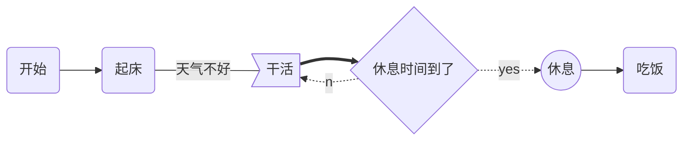
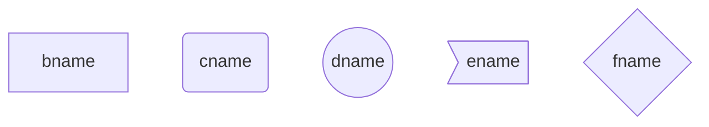
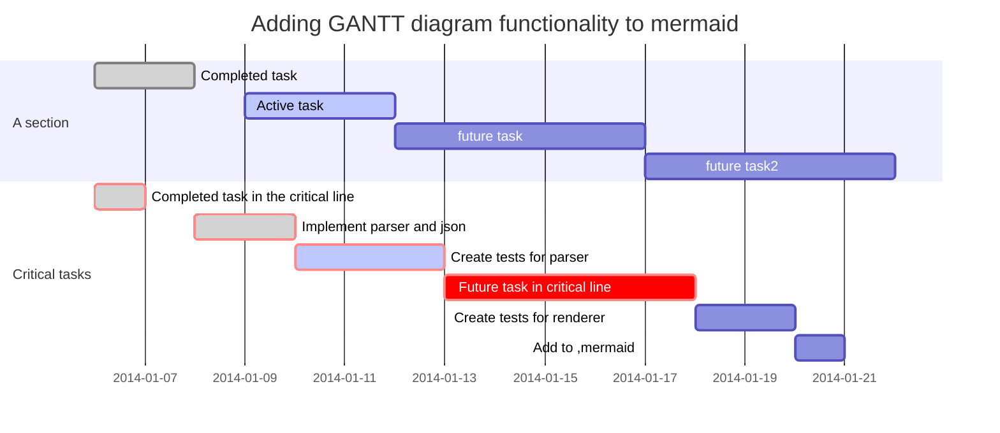

[TOC]

# Markdown语法

 ## 编辑操作

| 标题                   |                                                              |                  |
| :--------------------- | ------------------------------------------------------------ | ---------------- |
| ***插入功能***         |                                                              |                  |
| **操作名称**           | Markdown语法                                                 | 快捷键           |
| 标题级别               | #个数 代表 级数                                              | Ctrl + number    |
| 提升(降低)标题级别     |                                                              | Ctrl + = -       |
| **插入表格**           | \|文字\|文字\|文字\|                                         | Ctrl + T         |
| 下方插入行             |                                                              | Ctrl + Enter     |
| 上下移该行             |                                                              | Alt + ↑ ↓        |
| **图片的插入**         |                                                              | 拖拽本地图片     |
|                        | ``: 网络图片                            | Ctrl+Shift+I     |
| **超链接**             | \<http://www.\> :<http://www>   必须以http开头               |                  |
|                        | \[百度一下]\(www.baidu.com): [百度一下](www.baidu.com)       | Ctrl + K         |
| **代码区域**           | \` \` \`+编程语言    \~~~ + Enter[^常用语言](Linux命令:bash;) | Ctrl + shift + k |
| 行内代码               | \`printf()\`  :`printf()`;   `` ` ``     显示反单引号        |                  |
| **数学公式块**         | $$ latex用法 $$                                              | Ctrl+Shift+M     |
| 行内嵌                 | $   $                                                        |                  |
| 上下标                 | 2^10^   H~2~O                                                |                  |
| **插入引用块**         | >+空格  二级引用 >>                                          | Ctrl+Shift+Q     |
| **插入有序(无序)列表** | + 、- 、* 创建无序列，任意数字开始+空格创建有序列表          | Ctrl+Shift+[ ]   |
| **任务列表使用格式**   | - [ ] 文字 （注：注意用空格隔开                              |                  |
| **水平分割线**         | ***或者- - -                                                 |                  |
| **MD目录**             | [TOC]                                                        |                  |
| **跳转**               | \[点击跳转](#jump)                                           | jump即id要同     |
| 锚点                   | \<span id="jump">跳转到的地方\</span>                        |                  |
| **注释**               | 要添加注释的文字\[^注释内容]（内容） 括号内内容隐藏          |                  |
| **表情**               | :单词: :smile:\:simle:                                       |                  |
| 换行：                 | `<br>`                                                       |                  |
| **字体操作**           |                                                              |                  |
| 字体加粗               | \**加粗字体**                                                | Ctrl+B           |
| 下划线                 | `<u>下划线的内容<\u>`                                        | Ctrl+U           |
| 倾斜                   | \*字体倾斜了*                                                | Ctrl+I           |
| 删除线                 | \~~删除线的内容~~                                            | Alt+Shift+5      |
| 文本居中               | <center>这是要居中的文本内容</center>                        |                  |
| 高亮                   | ==高亮\==                                                    |                  |
| **字符转义**           | \                                                            |                  |
|                        |                                                              |                  |

### 字体大小颜色

`<font color=red size=5 face="微软雅黑">color=gray size=5</font>`

### 文字添加背景色

 `<table><tr><td bgcolor=yellow>背景色yellow</td></tr></table>`

### 图片大小设置

`<div align=center> \</div> ` [^ center居中,right居右,left居左]   

width="50%" height="50%"   设置图片百分比

 width="251" height="350"    设置图片大小

400x300

### RGB颜色对照表

[RGB颜色对照表](https://blog.csdn.net/heimu24/article/details/81192697)

 ## 软件操作

| *功能*                                                       |      *快捷键*      |
| :----------------------------------------------------------- | :----------------: |
| **视图**                                                     |                    |
| 大纲视图                                                     |    Ctrl+Shift+1    |
| 文件列表视图                                                 |    Ctrl+Shift+2    |
| 放大视图                                                     | Ctrl + Shift + + - |
| 恢复原来大小视图                                             |    Ctrl+Shift+9    |
| 显示隐藏侧边栏                                               |    Ctrl+Shift+L    |
| 源代码模式                                                   |       Ctrl+/       |
| **查找替换**                                                 |                    |
| 查找/搜索                                                    |       Ctrl+F       |
| 替换                                                         |       Ctrl+H       |
| 查找下一个                                                   |         F3         |
| 查找上一个                                                   |      Shift+F3      |
| **选择**                                                     |       Ctrl+        |
| 选择当前行/句                                                |       Ctrl+L       |
| 选择当前格式文本[^ 注解1](https://blog.csdn.net/Yuki_fx/article/details/选择当前格式文本会选择与光标停留位置格式相同，连续的文本) |       Ctrl+E       |
| 选择当前单词[^ 注解2](https://blog.csdn.net/Yuki_fx/article/details/选择单词，会选择一个单词，遇到空格或者符号才停止，所以对于英文是选择一个单词，中文是选择一小句话) |       Ctrl+D       |
| 删除当前单词                                                 |    Ctrl+Shift+D    |
| 跳转到所选内容                                               |       Ctrl+J       |
| 跳转到文首（文末）                                           |   Ctrl+Home End    |
| **文件操作**                                                 |                    |
| 新建                                                         |       Ctrl+N       |
| 打开文件                                                     |       Ctrl+O       |
| 快速打开(在最近打开中打开)                                   |       Ctrl+P       |
| 保存                                                         |       Ctrl+S       |
| 另存为                                                       |    Ctrl+Shift+S    |
| 关闭                                                         |       Ctrl+W       |
| 重新打开关闭的文件                                           |    Ctrl+Shift+     |

# 流程图、Gra图表、甘特图、时序图

[Markdown图](https://blog.csdn.net/qq_18150255/article/details/88043774?depth_1-utm_source=distribute.pc_relevant.none-task-blog-BlogCommendFromBaidu-1&utm_source=distribute.pc_relevant.none-task-blog-BlogCommendFromBaidu-1)

## 1.流程图

```flow
st=>start: Start
i=>inputoutput: 输入年份n
cond1=>condition: n能否被4整除？
cond2=>condition: n能否被100整除？
cond3=>condition: n能否被400整除？
o1=>inputoutput: 输出非闰年
o2=>inputoutput: 输出非闰年
o3=>inputoutput: 输出闰年
o4=>inputoutput: 输出闰年
e=>end
st->i->cond1
cond1(no)->o1->e
cond1(yes)->cond2
cond2(no)->o3->e
cond2(yes)->cond3
cond3(yes)->o2->e
cond3(no)->o4->e
```

```flow
    open=>start: Open:>https://github.com/knsv/mermaid
    userInput=>inputoutput: User Input
    processes=>operation: Processes
    results=>condition: Yes or No?
    regis=>condition: GoSignUp,Yes or No?
    userr=>operation: SignUp
    end=>end: End
    open->userInput->processes->results
    results(yes)->end
    results(no)->regis
    regis(yes)->userr
    regis(no)->userInput
```


### flow语法

| 类型 | start            | end         | operation         | subroutine       | condition                    | inputoutput      |
| ---- | ---------------- | ----------- | ----------------- | ---------------- | ---------------------------- | ---------------- |
| 作用 | 开始             | 结束        | 操作、执行        | 子分支           | 条件                         | 输入、输出       |
| 例子 | st=>start: Start | e=>end: End | op1=>operation:op | sub=>subroutine: | cond=>condition: yes or no ? | io=>inputoutput: |

- content为流程图中文本框需要描述的文字，注意type后面的冒号与content之间有个空格，不然生成不了流程图

- url表示一个链接，与框中的文本相绑定，:>后面就是对应的 url 链接，点击文本时可以通过链接跳转到 url 指定页面

- 用 -> 来连接两个元素

- 对于condition类型，有yes和no两个分支，如示例中的cond(yes)和cond(no)

- 每个元素可以设置分支走向，默认向下（bottom），也可以用left指向左边或者用right指向右边，如示例中sub1(right)。

## 2.Graph图表



### 节点形状



### graph关键字

graph TB表示流程图从上到下开始，TB表示设置该图起始的方向，方向的定义如下：

1. TB（ top bottom）表示从上到下
2. BT（bottom top）表示从下到上
3. RL（right left）表示从右到左
4. LR（left right）表示从左到右

## 3.时序图

```sequence
Title:时序图示例
客户端->服务端: 我想找你拿下数据 SYN
服务端-->客户端: 我收到你的请求啦 ACK+SYN
客户端->>服务端: 我收到你的确认啦，我们开始通信吧 ACK
Note right of 服务端: 我是一个服务端
Note left of 客户端: 我是一个客户端
Note over 服务端,客户端: TCP 三次握手
participant 观察者
```

## 4.甘特图




### 关键词说明：

title—标题
dateFormat—日期格式
section—模块
Completed—已经完成
Active—当前正在进行
Future—后续待处理
crit—关键阶段


$$
\mathbf{V}_1 \times \mathbf{V}_2 =  \begin{vmatrix} 
\mathbf{i} & \mathbf{j} & \mathbf{k} \\
\frac{\partial X}{\partial u} &  \frac{\partial Y}{\partial u} & 0 \\
\frac{\partial X}{\partial v} &  \frac{\partial Y}{\partial v} & 0 \\
\end{vmatrix}
${$tep1}{\style{visibility:hidden}{(x+1)(x+1)}}
$$